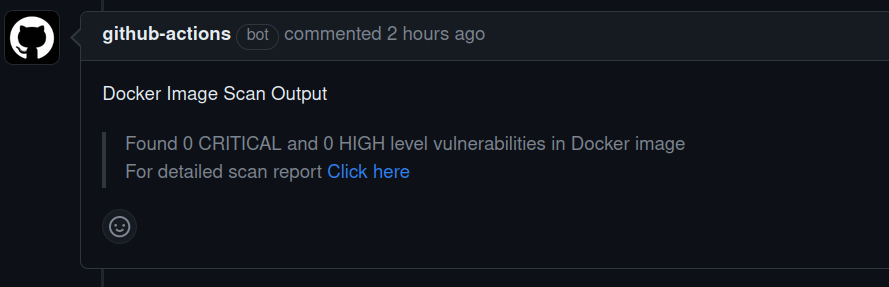
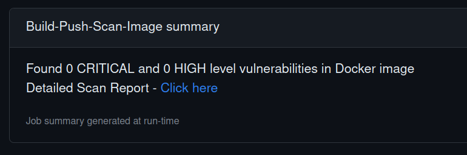

# ECR Image Scanning GitHub Action

This GitHub Action automatically scans an ECR (Elastic Container Registry) image when it is pushed to the repository. It utilizes the AWS CLI and ECR scanning capabilities to perform the scan and provide a scan report.

## Pre-requisites

To use this action, ensure that you have the AWS CLI installed and properly configured in your runner environment. Additionally, make sure you provide the required AWS credentials with the necessary permissions to access and scan the ECR image.Also make sure to disable scan on push to the ecr repository.


## Description

This action utilizes a shell script executed within a Docker container to identify critical and high-level vulnerabilities linked to an image being pushed to the ECR repository.
## Usage
```
name: Push to ECR

on:
  pull_request:
    branches:
      - main
jobs:
  Build-Push-Scan-Image:
    runs-on: ubuntu-latest 
    steps:
    - name: Scan Docker image
      id: docker-scan
      uses: KeyValueSoftwareSystems/action-ecr-image-scan@main
      env:
        ECR_REPOSITORY: apparel-backend
        IMAGE_TAG:  	${{ github.sha }}
      with:
        ecr_repository: ${{ env.ECR_REPOSITORY }}
        image_tag: ${{ env.IMAGE_TAG }}
        pr_comment: true
        github_token: ${{ secrets.GITHUB_TOKEN }} 
        url: ${{ github.event.pull_request.comments_url }}
        aws_region: ap-south-1    
    - name: Fail workflow if vulnerabilities found
      env:
        vulnerability: ${{ steps.docker-scan.outputs.VULNERABILITY }}  
        block_build_on_failure: true               
      run:  | 
        if [ "${{env.block_build_on_failure }}" = true && "${{ env.vulnerability }}" = true ]; then
        exit 1
        fi
```
## Input

   - aws-region (required): The AWS region where your ECR repository is located.
   - ecr_repository (required): The name of your ECR repository.
   - image_tag (required): Tag of the image being pushed
   - pr_comment (required): true/false   
   - github_token (required): For updating th PR comment with scan result
   - url (required): URL for calling the POST request to update PR

## Output

After the scan is completed, this action will produce the scan results and provide a link to the scan report. The scan report and the detailed report URL in the AWS console will be included as comments in the pull request and displayed in the GitHub step summary for easy access and visibility.
### Parameters passed as ouput
     
  - VULNERABILITY : If vulnerabilities are detected or not


## Sample Output
#### Github PR comment


#### Github Summary Report

